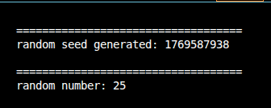

# Random number sorting demo


[](https://opensource.org/licenses/MIT)

a project i made to get used to randomness in c. using a seed we generate random numbers and since that seed gets choosen every single time the program runs and changes what random numbers you get, you always get random numbers

the example.c file includes a example use in which you subtract a certain amount of health from an enemy which involves a random fluctuation.


---

## Tech Stack

- Language: C
- Main libs/frameworks: time, std, io

---

## Features


- generating a random seed (and displaying that)
- generating a example random number (and displaying that as well
- including a use case with example.c
- 


- just a demo, it's done
  

---

### Installation

```bash
# clone the repo
git clone https://github.com/CodeWithCompound/c-random-demo.git
cd REPO_NAME
